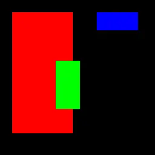

This section covers the graphics capabilities and API of the Game SDK for VGC Zero. It includes information on basics of drawing and drawing shapes.

## Drawing basics
The Game SDK provides a variety of functions for drawing shapes, images, and text to the `screen`.

The `screen` is an instance of a `Surface` class, stored in a global variable - which means you can access it directly from anywhere in your code.

The `Surface` class represents a 2D drawing surface, and provides methods for rendering graphics.

The `Pen` class represents a color, which can be created using RGB values or predefined colors.

Below are listed all the drawing functions available in the SDK. You can call those methods on any `Surface` instance. 

You should call all drawing functions within the `render` function, which is called once per frame.
```cpp
void render(uint32_t time) {
    // Drawing code goes here
}
```

> [!TIP]
> Use blit namespace to avoid prefixing all calls with `blit::`.
> ```cpp
> using namespace blit;
> ```

### Setting the pen color
Before drawing, you need to set the pen color. To set the current pen color, create a `Pen` object and assign it to the `pen` property of the `Surface`.

```cpp
screen.pen = Pen(255, 0, 0); // Set pen color to red
```

### Clearing the screen
To clear the screen, you can use the `clear()` method.

```cpp
screen.pen = Pen(0, 0, 0); // Set pen color to black
screen.clear(); // Clear the screen (fill with black)
```


This fills the entire surface with the current pen color.


### Drawing shapes
You can draw various shapes using the following methods:

#### Pixel
To draw a single pixel on the surface, use the `pixel()` method. This method takes one parameter: a `Point` object representing the coordinates of the pixel to draw.

`screen.pixel(Point &p)`

```cpp
screen.pen = Pen(0, 0, 0); // Set pen color to black
screen.clear(); // Clear the screen (fill with black)
screen.pen = Pen(255, 0, 0); // Set pen color to red
screen.pixel(Point(64, 64)); // Draw a pixel (red) at (64, 64)
```

")

#### Rectangle
To draw a filled rectangle on the surface, use the `rectangle()` method. This method takes one parameter: a `Rect` object representing the position and size of the rectangle to draw.

`screen.rectangle(Rect &r)`

```cpp
screen.pen = Pen(0, 0, 0); // Set pen color to black
screen.clear(); // Clear the screen (fill with black)
screen.pen = Pen(255, 0, 0); // Set pen color to red
screen.rectangle(Rect(10, 10, 50, 100)); // Draw a red rectangle at (10,10) with width 50 and height of 100
screen.pen = Pen(0, 0, 255); // Set pen color to blue
screen.rectangle(Rect(80, 10, 34, 15)); // Draw a blue rectangle at (80,10) with width 34 and height of 15
screen.pen = Pen(0, 255, 0); // Set pen color to green
screen.rectangle(Rect(46, 50, 20, 40)); // Draw a green rectangle at (46,50) with width 20 and height of 40
```



> [!TIP]
> Notice how the rectangles overlap. The last rectangle drawn appears on top of the previous one. This is because drawing operations are performed in the order they are called.

#### Vertical span
To draw a vertical line segment, use `v_span()`. The `Point` sets the starting coordinate, and the `int16_t` value sets how many pixels to draw downward from that point.

`screen.v_span(Point p, int16_t c)`

```cpp
screen.pen = Pen(0, 0, 0);
screen.clear();
screen.pen = Pen(255, 255, 0);
screen.v_span(Point(64, 20), 80); // Draw a vertical yellow span 80 pixels tall starting at (64, 20)
```

#### Horizontal span
To draw a horizontal line segment, use `h_span()`. The `Point` sets the starting coordinate, and the `int16_t` value sets how many pixels to draw to the right from that point.

`screen.h_span(Point p, int16_t c)`

```cpp
screen.pen = Pen(0, 0, 0);
screen.clear();
screen.pen = Pen(255, 0, 255);
screen.h_span(Point(20, 64), 100); // Draw a horizontal magenta span 100 pixels wide starting at (20, 64)
```

#### Line
To draw a straight line between two points, use the `line()` method.

`screen.line(const Point &p1, const Point &p2)`

```cpp
screen.pen = Pen(255, 255, 255);
screen.line(Point(10, 10), Point(120, 90)); // Draw a white line from (10, 10) to (120, 90)
```

#### Circle
To draw a circle outline, use the `circle()` method. Pass the center `Point` and a radius in pixels.

`screen.circle(const Point &c, int32_t r)`

```cpp
screen.pen = Pen(0, 200, 255);
screen.circle(Point(64, 64), 30); // Draw a cyan circle centered at (64, 64) with radius 30
```

#### Triangle
To draw a triangle connecting three points, use the `triangle()` method.

`screen.triangle(Point p1, Point p2, Point p3)`

```cpp
screen.pen = Pen(255, 128, 0);
screen.triangle(Point(30, 90), Point(90, 20), Point(140, 110)); // Draw an orange triangle
```

#### Polygon
To draw a polygon from a list of points, use the `polygon()` method with a `std::vector<Point>`.

`screen.polygon(std::vector<Point> p)`

```cpp
screen.pen = Pen(0, 255, 128);
screen.polygon({
    Point(30, 60),
    Point(70, 30),
    Point(110, 60),
    Point(100, 110),
    Point(40, 110)
}); // Draw a green pentagon
```