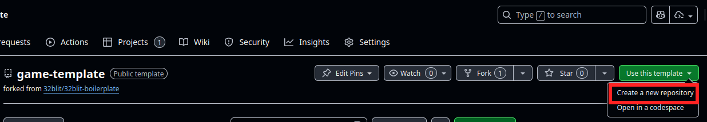

This guide will help you get started with setting up your development environment on Linux and creating your first game for the VGC Zero console.

### Prerequisites

Some experience writing/compiling C/C++ software is required.

You'll need to install:

- Git
- CMake (at least 3.9)
- Make (or another build tool like Ninja)
- Python (at least 3.6) + pip
- The 32blit tools
- GCC
- SDL2 + SDL2_image + SDL2_net

U can install all of these on Ubuntu/Debian with:

```bash
sudo apt install git gcc g++ gcc-arm-none-eabi cmake make \
python3 python3-pip python3-setuptools \
libsdl2-dev libsdl2-image-dev libsdl2-net-dev unzip
```

Then install the 32blit tools:

```bash
pip install 32blit
```

### Building and running locally

1. Clone the SDK repository

    ```bash
    git clone https://github.com/chili-chip/32blit-sdk
    ```

2. Create a new game project using our [game template](https://github.com/chili-chip/game-template)

    

    Or you can clone one of our sample games, like [chili tetris](https://github.com/chili-chip/chili-tetris).

    ```bash
    git clone https://github.com/chili-chip/chili-tetris
    ```

    Your directory structure should look like this:


    ```
    project_root/
    ├── 32blit-sdk/
    └── your-project/
    ```

3. Build the game

    ```bash
    cd your-project
    mkdir build
    cd build
    cmake ..
    make
    ```

4. Run the game locally

    ```bash
    ./game
    ```

    This will launch the game in a window on your desktop using SDL2.
    Now you can test and develop your game locally before deploying it to the VGC Zero hardware.

### Building for VGC Zero

1. Get necessary tools

    - pico-sdk
    - pico-extras

    Clone the pico-sdk and pico-extras repositories:
    ```bash
    git clone https://github.com/raspberrypi/pico-sdk
    git clone https://github.com/raspberrypi/pico-extras
    ```

    Your directory structure should look like this:

    ```
    project_root/
    ├── 32blit-sdk/
    ├── pico-sdk/
    ├── pico-extras/
    └── your-project/
    ```

2. Create a build directory

    ```bash
    cd your-project
    mkdir build.vgc
    cd build.vgc
    ```

3. Configure the build for VGC Zero

    Run `cmake` with the board and platform specified:

    ```bash
    cmake .. \
    -D32BLIT_DIR=../../32blit-sdk \
    -DPICO_SDK_PATH=../../pico-sdk \
    -DPICO_BOARD=chilichip_vgc \
    -DPICO_PLATFORM=rp2350-arm-s \
    -DCMAKE_TOOLCHAIN_FILE=../../32blit-sdk/pico2.toolchain
    ```

> Adjust paths if your SDKs are located elsewhere relative to your project directory.

4. Build the game for VGC Zero

    ```bash
    make
    ```

    This will produce a `.uf2` file in the `build.vgc` directory.

### Flashing to VGC Zero

1. Connect your VGC Zero to your computer via USB.
2. Put the VGC Zero into bootloader mode by holding down the BOOT button while plugging it in.
3. Your computer should recognize the VGC Zero as a removable drive named `RPI-RP2`.
4. Copy the generated `.uf2` file from the `build.vgc` directory to the `RPI-RP2` drive.
5. The console will reboot and run your game.

### Troubleshooting

If pip installs to a directory not on PATH:

```bash
export PATH=$PATH:~/.local/bin
```